---
copyright:
  author: 异想之旅 | YuzhenQin | 程家麒
permalink: /3aka4vaa/
---

# 如何运行 Python 代码

::: warning
本节方法主要针对 Windows 用户。
:::

无论采用下面所介绍的哪一种运行方式，你都需要在电脑上安装好 Python 环境，具体可以参考前面几节的内容。

## 交互式运行（即IDLE）

### 第一步，打开电脑的命令行工具

Windows 打开方式：按下 `Win + R` 组合键，输入 `powershell`，回车打开。

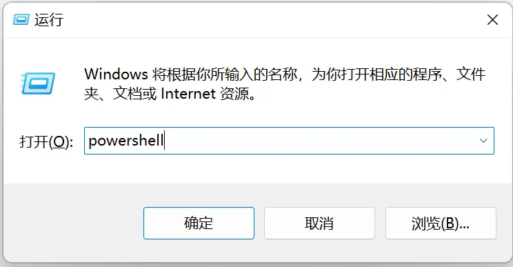

也可以使用Windows开始菜单搜索，也是可以的。

::: note
快捷键：`Win + X` 呼出的菜单中同样可以找到
特别注意：win10菜单中显示的是“Windows PowerShell“，而win11菜单中显示的是“Windows 终端”
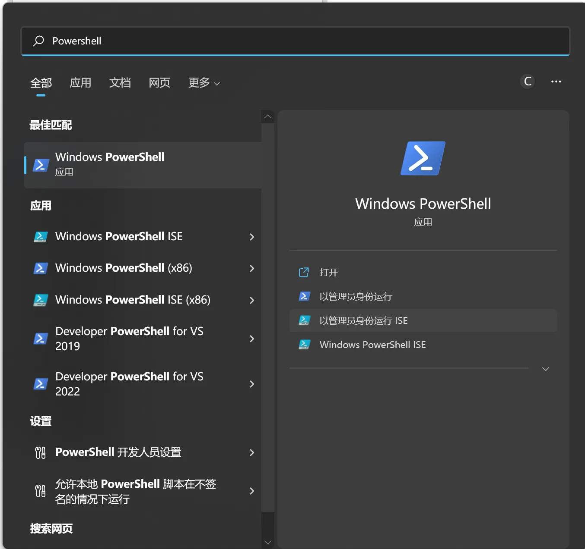
:::

### 第二步，输入`python`（Mac/Linux 则是 `python3`）

即可进入**交互式终端 Python Shell**。

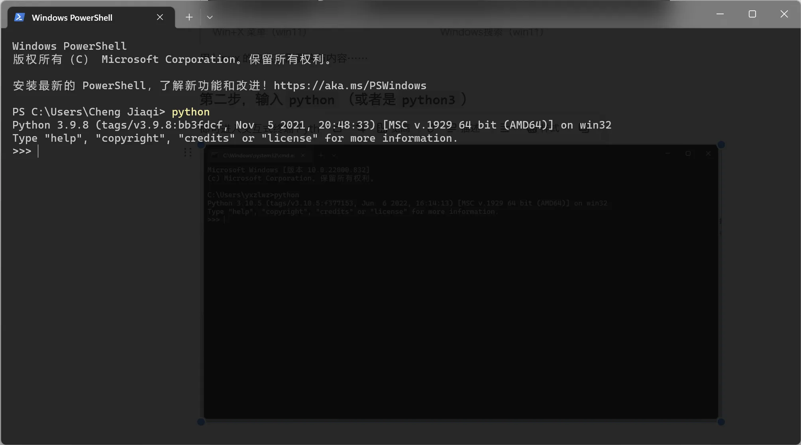

在这里输入代码和直接打开 IDLE 的效果是一样的。

### 第三步，书写代码

在这里输入的的代码每敲击一次回车就会被实时运行出来，可随时查看各个表达式的值——甚至不需要 `print()`。缺点就是运行的代码不能保存。我们通常使用这一交互式终端测试 Python 语法或者学习新接触的库。

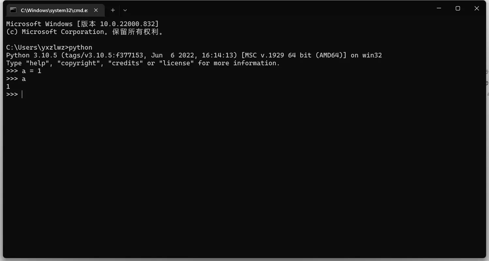

### 退出 Python Shell

- 方式一：快捷键 `Ctrl + Z`（可能需要回车）。
- 方式二：手动在 Shell 中输入：`exit()` 后，回车执行命令
- 方式三：看到这个黑框框右上角的那个叉叉了吗？对，点一下就行了。

### 另一种方式：Python IDLE

通常情况下，你可以直接在 Windows 的开始菜单或 Mac 的启动台中找到它。点击后，你会得到一个可交互运行的窗口，使用方式与 Python Shell 无二。

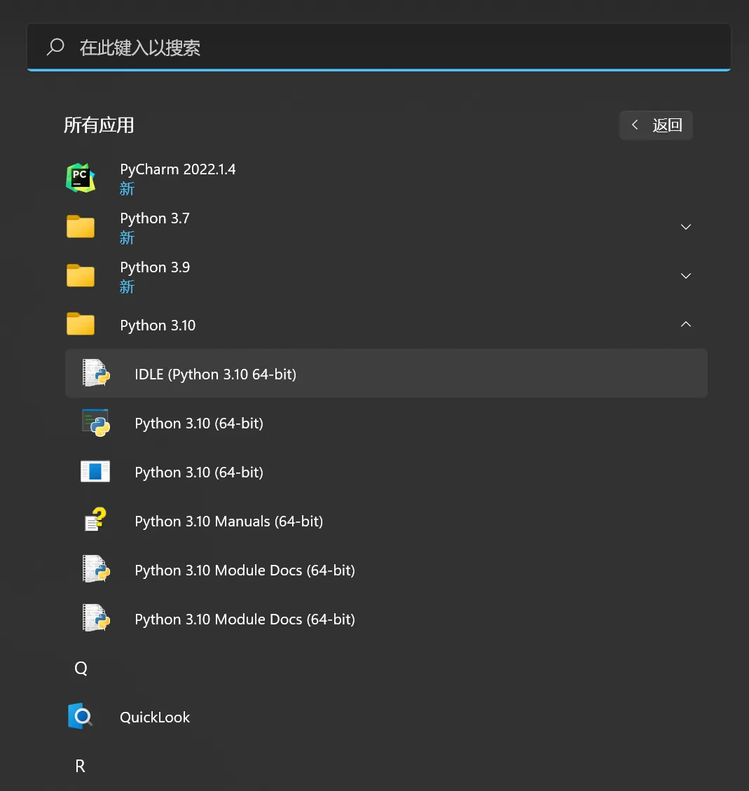

## 运行 Python 文件

### 第一步，还是打开命令行工具

### 第二步，`cd` 切换到 `.py` 文件所在的目录

在每一行开头处、`>` 符号前会显示一个你电脑中的文件夹路径，这是当前命令行的工作目录。我们需要使用 `cd` 命令切换到存放 Python 文件的目录下。

在 cmd 中，如果文件不在 C 盘，可能需要我们 `cd` 后再切换一次：

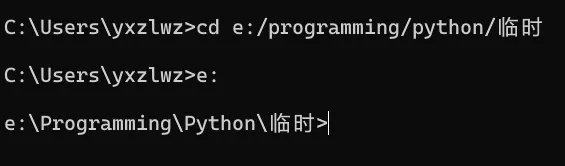

亦或者，直接在 Windows 文件资源管理器地址栏单机空白区域，输入 `cmd`（下图以cmd做演示），然后回车：

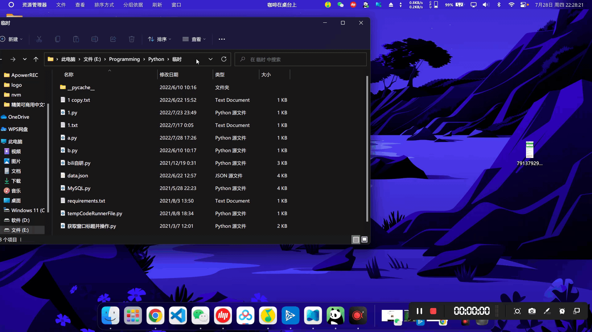

::: note
此时唤出的 CMD 命令行的工作目录已经处于当前文件夹下。
:::

## 使用 Visual Studio Code

Visual Studio Code 是一款较为流行和专业的代码编辑器。通过安装插件，你可以使用 Visual Studio Code 完成许多语言的开发。

这部分内容我们在[另一项目](https://docs.yxzl.dev/)中进行了更为详细的介绍，感兴趣的读者可以前往查看：

- [VS Code 安装和基础配置](https://docs.yxzl.dev/vscode/rcgpbdlp/)
- [VS Code Python 开发环境配置](https://docs.yxzl.dev/vscode/4uja7z83/)

<!-- ::: collapse

-   原始内容（不建议）
    ### 首先从官网下载安装

    [Visual Studio Code - Code Editing. Redefined](https://code.visualstudio.com/)

    ::: note
    网信办为了保护我国脆弱的人民似乎把这个网站也墙掉了，访问极不稳定。如果你是 Windows，可以使用[此链接](https://sw.pcmgr.qq.com/a6518ae2056ff6810c6a8b508e95f3cf/68e3b2b3/spcmgr/download/VSCodeUserSetup-x64-1.99.3.exe)下载（更新时间：2025-04-18）。
    :::

    ### 打开软件，安装插件

    使用 `Ctrl + Shift + X`（Mac 为`command + shift + X`）打开插件安装界面。推荐安装如下内容：

    - **Chinese (Simplified) (简体中文) Language Pack for Visual Studio Code**：中文语言包，安装后需根据软件右下角的提示切换语言
    - **Python**：对 Python 语言的较完整支持。**请认准发布者为 Microsoft、名称为且仅为 Python 的插件**。
    - **Code Runner**：代码运行插件
    - **yapf**（本人使用）或 **Black Formatter**（更流行）：Python 代码格式化插件，使你的代码阅读起来更舒服。安装后，可以在打开任何 Python 文件后使用快捷键 `Shift + Alt + F`（Mac 为`shift + option + F`）来使用。

    ### 必要的设置

    按下快捷键 `Ctrl + ,`（Mac 为`command + ,`）即可打开设置界面。你也可以通过左下角的按钮进入。

    #### 字体大小

    在设置中第一位的 `Editor: Font Size` 用于控制代码书写时的字体大小。通常设置为 17-19 较为合适。

    在上方搜索框输入 `terminal.integrated.fontSize`，将对应设置调整为 16（这是我推荐的数值，稍后你知道终端是什么以后可以根据自己喜好修改）。

    #### Code Runner 配置

    在搜索框输入 `Code-runner: Run In Terminal`，勾选前面的对勾（如果找不到这一个设置项，请重启软件）：

    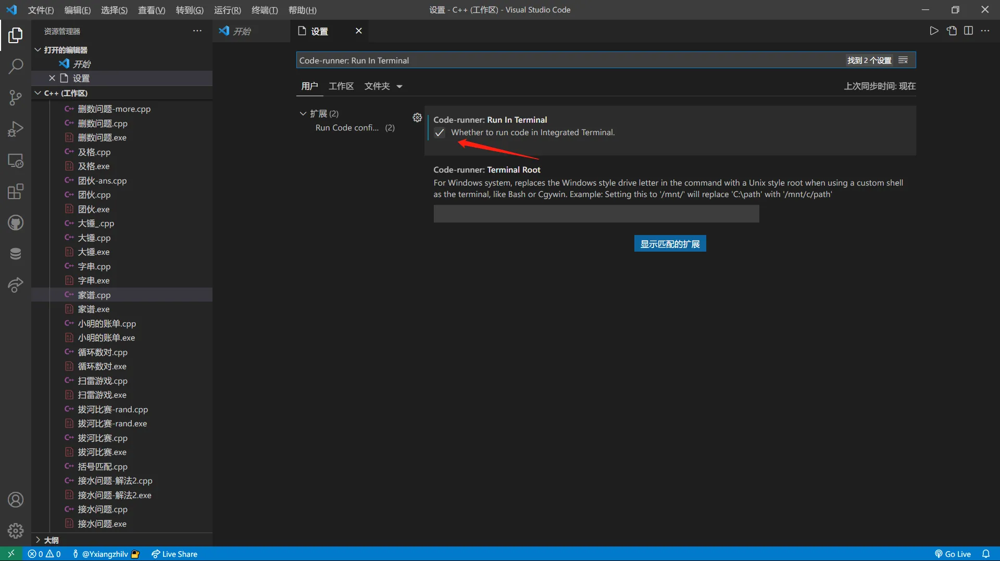

    此设置用于指定在终端中运行 Python 程序，方便学习终端的使用和使用 input 函数。

    ::: details Mac 用户需要配置的 Code Runner 选项
    Code Runner 默认使用 `python` 命令来运行程序。而在 Mac 上，通常需要输入 `python3` 才能正常找到 Python 解释器。因此，我们需要进行特别设置。

    在设置界面（打开方式见上文），点击右上角的按钮打开配置文件。

    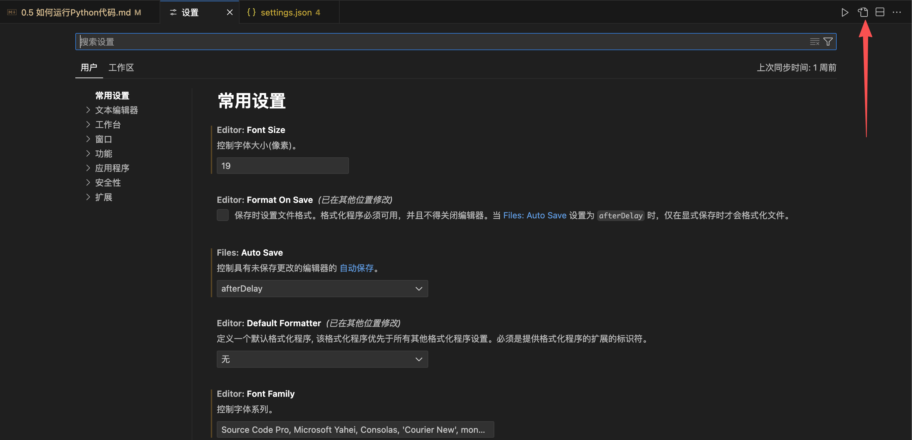

    找到 `code-runner.executorMap`，再在其中找到 `python`，将后面的 `python -u` 更改为 `python3 -u`。

    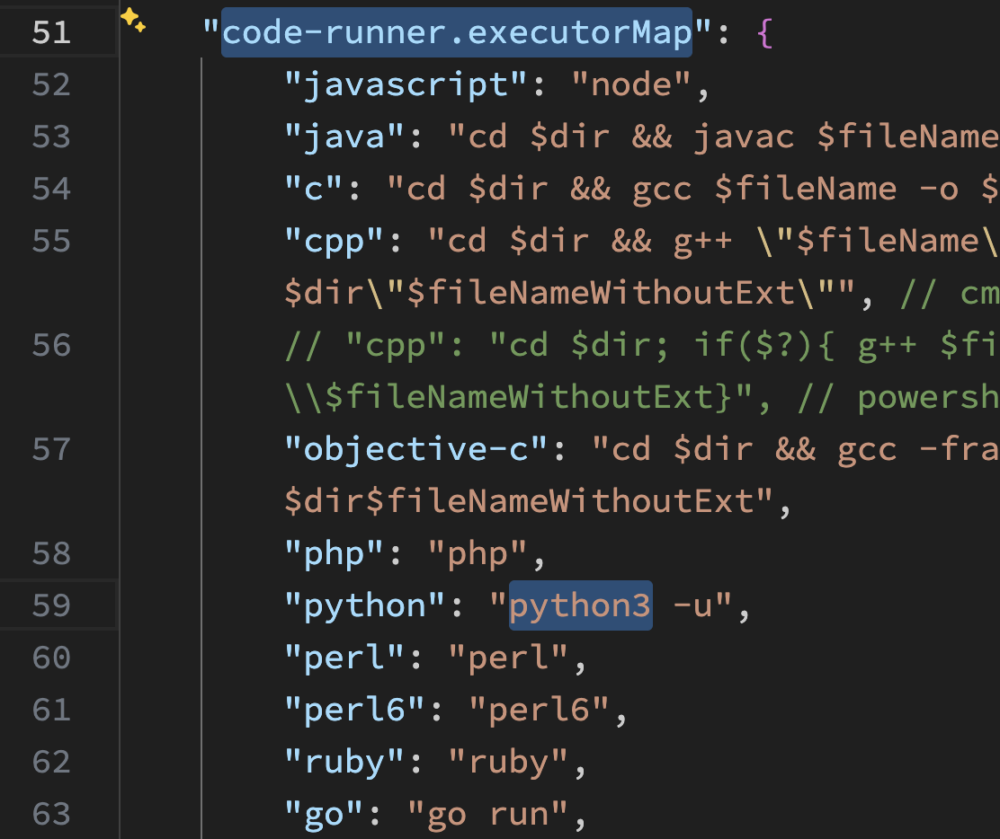
    :::

    ### 新建代码文件，编辑好后保存运行

    可以点击右上角的运行按钮或者按下快捷键 `Ctrl + Alt + N`（Mac为`control + option + N`）。

    如果你的运行按钮如下图所示，有一个爬虫的角标，请先点击下拉三角，再选择 Run Code 选项。

    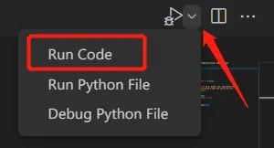

    代码文件将在下方的终端运行出来。

    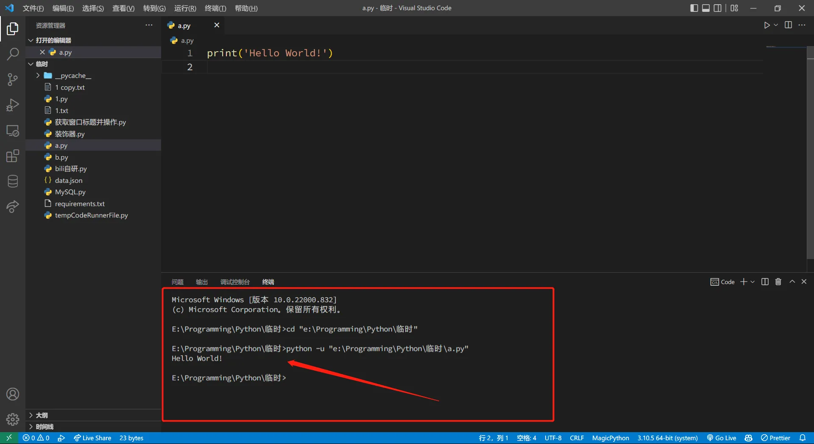

    如果你的代码有用到 `input` 函数获取用户输入，请先**用鼠标在图中箭头位置单击**以选定焦点位置，再进行输入。

    请一定记得**先保存再运行代码**（快捷键为 `Ctrl + S` 或 `command + S`）。你也可以在顶部菜单的“文件”中找到“自动保存”并勾选。

    ::: note
    Windows 下，Visual Studio Code 打开的终端就是一个 CMD 或 PowerShell （上图红框中为PowerShell），你也可以直接在里面写你要执行的命令。默认情况下打开的是一个 PowerShell 。
    :::

::: -->
