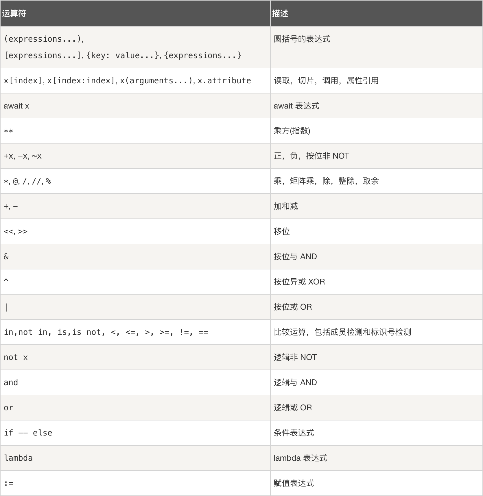

---
copyright:
  author: 异想之旅
permalink: /yj27sphw/
---
# 逻辑运算

通常情况下，逻辑运算返回的值是布尔（bool）类型。

## 数值判断

我们可以对数字进行大小判断：

::: python-repl title="运行代码" editable
```python
a = 1
b = 1.0
c = 3.14

print(a == b)  # 判断a和b是否相等，输出：True
print(a != c)  # 判断a和b是否不相等，输出：True
print(a < c)  # 判断a是否小于c，输出：True
print(a > c)  # 判断a是否大于c，输出：False
print(a <= b)  # 判断a是否小于等于b，输出：True
print(b <= c)  # 判断b是否小于等于c，输出：True
```
:::

由上例可得：

- 数据类型 `int` 和 `float` 不影响数值大小的比较
- 判断是否相等使用 `==` 而非 `=` ，因为 `=` 在Python中已经被变量赋值操作使用

## 字符串判断

下面是一个简单的示例，用于判断两个字符串的内容是否相同：

::: python-repl title="运行代码" editable
```python
print("HelloWorld" == 'HelloWorld')  # True
print('Hello' != "Hello")  # False
```
:::

更多的时候，我们通过字符串的 `.isxxx()` 方法来对其的值进行一些判断校验，具体可参考 1.5 章节的“字符串方法”部分。

## not取反

::: python-repl title="运行代码" editable
```python
a, b = 5, 10  # 一个Python风格的多变量赋值语句，记一下就好

print(a > b)  # False
print(not a > b)  # True
```
:::

`not` 语句可以将一个布尔值取反操作。

::: python-repl title="运行代码" editable
```python
print(not 0)  # True
print(not '123')  # False
print(not 3.14)  # False
```
:::

`not` 也可以直接处理一个其它数据类型，具体实现是先将其强制转换为 `bool` 类型，然后再取反。

关于其它数据类型强制转换为 `bool` 后值为多少的问题，详见[强制类型转换](/bb255f7m/#例04-强制类型转换)。

## 成员运算符

除了大小之外，一个元素与一个序列的关系也是逻辑运算的重要部分。我们使用成员运算符 `in` 和 `not in` 来实现相关操作。

### 判断元素是否在列表中

::: python-repl title="运行代码" editable
```python
a = [1, 2, 3, 4]

print(1 in a)  # True
print(5 in a)  # False
```
:::

### 判断字符串是否被另一个字符串包含

::: python-repl title="运行代码" editable
```python
a = 'ABCDEFG'

print('DEF' in a)  # True
print('FGH' in a)  # False
print('HIJ' not in a)  # True
```
:::

## and 和 or

### 搭配逻辑运算

分别表示“与”（同时成立）和“或”（成立至少一个），也非常好理解，直接上代码：

::: python-repl title="运行代码" editable
```python
print(1 < 2 and 2 < 3)  # True
print(1 < 2 and 3 < 2)  # False

print(1 < 2 or 3 < 2)  # True

print(1 < 2 or 3 < 2 and 4 < 5)  # True
```
:::

### 搭配数值

本质上，“搭配数值”和“搭配逻辑运算”的原理是一样的。`and` 和 `or` 不一定返回 bool 类型，而是==返回第一个能够完成语句 True 和 False 判断的数据==。

具体来说（下面所提及的“第一个”和“最后一个”都只考虑 `and` 或 `or` 语句两边的两个值）：

- 如果 `and` 语句为真，返回最后一个在 `bool` 类型下值为 `True` 的数据的**实际值**
- 如果 `and` 语句为假，返回第一个在 `bool` 类型下值为 `False` 的数据的**实际值**
- 如果 `or` 语句为真，返回第一个在 `bool` 类型下值为 `True` 的数据的**实际值**
- 如果 `or` 语句为假，返回最后一个在 `bool` 类型下值为 `False` 的数据的**实际值**

::: python-repl title="运行代码" editable
```python
print('Hello' and 'World')  # World
print([] and 'World')  # []
print('Hello' or 'World')  # Hello
print('' or 1)  # 1
```
:::

## 运算优先级问题

下图展示了完整的运算优先级定义：



请特别注意，==`and` 的优先级高于 `or`==。这一现象可以通过下面的例子说明：

::: python-repl title="运行代码" editable
```python
print(True or False and False)  # 输出：True
```
:::
