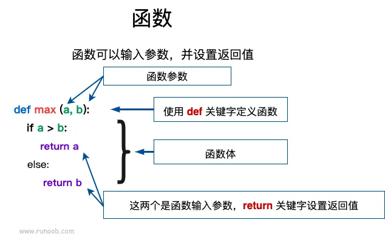

---
copyright:
  author: 异想之旅 ｜ YuzhenQin ｜ 程家麒
permalink: /aaf3e2gj/
---

# 函数（一）

函数是设计好的，可重复使用的，用来实现单一或相关联功能的代码段。

函数能提高应用的模块性，和代码的重复利用率。你已经知道 Python 提供了许多内建函数，比如 `print()`。但你也可以自己创建函数，这被叫做用户自定义函数。

本例中知识比较多，如果采用文字讲解将涉及大量没有太大意义的晦涩的专业术语。因此，我们还是通过摘抄菜鸟教程的示例，用大量的代码块引导大家自行从中总结规律。

## 定义一个函数

还是先放出总体的概念，不求理解，你只需要阅读后查看下面的示例即可。

你可以定义一个实现自己想要功能的函数，以下是简单的规则：

- 函数代码块以 `def` 关键词开头，后接函数标识符名称和圆括号 `()`
- 圆括号之间可以用于定义参数
- 函数内容以冒号 `:` 起始，并且缩进
- `return` 结束函数，选择性地返回一个值给调用方（没有 `return` 的函数默认返回 `None`）



## 例01 一个简单的函数

使用函数来输出 `'Hello World!'`：

::: python-repl title="运行代码" editable
```python
def hello_1() :
    print('Hello World!')

hello_1()  # 输出：Hello World!
```
:::

前两行语句，我们定义了一个函数 `hello_1`，并在第四行通过 `hello_1()` 的形式调用它。

调用函数时，Python 会执行我们定义的函数内容（即第2行），因此本例的运行结果等效于执行第2行的语句。

## 例02 带返回值的函数

更多的时候，我们并不希望一个函数直接完成输出功能，而希望它通过 `return` 语句将值返回回来，以便程序保存该结果并进一步处理。

::: python-repl title="运行代码" editable
```python
def hello_2() :
    return 'Hello World!'

print(hello_2())  # 输出：Hello World!
result = hello_2()  # 自然也可以将返回值存入变量
print(result)  # 输出：Hello World!
```
:::

## 例03 带参数函数

::: python-repl title="运行代码" editable
```python
def max(a, b):
    if a > b:
        return a
    else:
        return b

print(max(2, 1))  # 输出：2

a = 4
b = 5
print(max(a, b))  # 输出：5
```
:::

本例中，函数`max`接受两个参数`a`与`b`，并通过比较返回两者中的较大值。、

这里我们要对**形式参数**（形参）和**实际参数**（实参）做一个介绍：

- 形式参数：在定义函数或过程的时候命名的参数，通俗讲就是一个记号。形式参数一定要使用变量来存储。注意：形式参数只对这个函数内部有效，函数外部是无法调用形式参数的！
- 实际参数：在程序执行中调用函数时，传递给函数的参数，通俗讲就是实际值。实际参数可能是定量（如第七行的`1`和`2`）或变量（如第十一行的`a`与`b`）

当然，在更多的时候，形式参数与实际参数的名称不会一一对应，这完全不影响程序的运行。

::: python-repl title="运行代码" editable
```python
def max(x, y):
    if x > y:
        return x
    else:
        return y

a = 4
b = 5
print(max(a, b))  # 输出：5
```
:::

::: info
实际上 Python 内置了用于判断多个对象最大值的 `max()` 函数，此处为方便说明而自定义一份。
:::

形式参数的定义方式和实际参数的传递方式有着五花八门的方式，你将在下例中见识到。

## 例04 关键字参数

::: python-repl title="运行代码" editable
```python
def output(a, b):
    print(a, b)

output(a=2, b=3)  # 输出：2 3
output(b=2, a=3)  # 输出：3 2
```
:::

在传递参数时，我们可以在实际参数前面加上形式参数的名称，以使得代码更加直观和严谨。同时，由于指定了形式参数的名称，因此传递的顺序不再重要，我们可以按照任意顺序进行参数的传递。

“普通方式”和“关键字方式”两种参数传递方式可以混合使用：

::: python-repl title="运行代码" editable
```python
def output(a, b, c):
    print(a, b, c)

output(1, 2, 3)  # 输出：1 2 3
output(1, b=2, c=3)  # 输出：1 2 3
output(1, c=2, b=3)  # 输出：1 3 2
output(b=1, c=2, a=3)  # 输出：3 1 2
```
:::

对于上例的第5-6行：如果混用关键字参数和普通参数，**普通参数必须在前**。运行下面的代码会报错：

```python
def output(a, b, c):
    print(a, b, c)

output(1, c=2, 3)  # 报错SyntaxError：如果混用关键字参数和普通参数，必须普通参数在前
```

## 例05 默认参数

对于一个定义冗长的变量，许多时候会出现绝大多数的用户始终“为一个形式参数传递同样的实际参数”的情况。

因此，Python 允许我们为形式参数指定默认值：

::: python-repl title="运行代码" editable
```python
def output(name='小明'):
    print('Hello,', name)

output('小红')  # 输出：Hello, 小红
output(name='异想之旅')  # 输出：Hello, 异想之旅
output()  # 输出：Hello, 小明
```
:::

需要注意的是，在定义时，带默认值的参数必须放在普通参数的后面：

::: python-repl title="运行代码" editable
```python
def output(name, lang='chinese'):
    if lang == 'chinese':
        print('你好，' + name)
    else:
        print('Hello, ' + name)

output('小红', 'english')  # 输出：Hello, 小红
output('小红')  # 输出：你好，小红
output(name='异想之旅', lang='chinese')  # 输出：你好，异想之旅
```
:::
