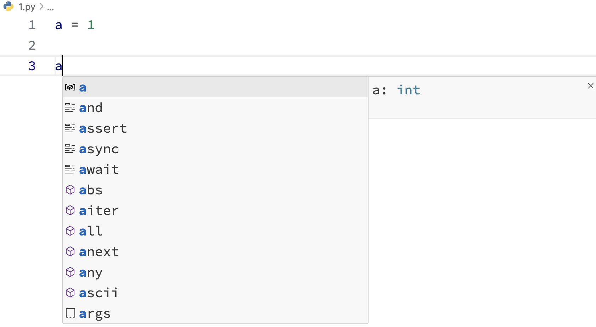

---
copyright:
  author: 异想之旅
permalink: /zjqpxj2u/
---

# 类型注解

如果你学过 C++，你一定对这样的代码不陌生：

```cpp
int a = 1;
float b = 3.14;
string c = "Hello World";
```

在某些编程语言中，变量需要在定义时就指定其类型。这样会在一定程度上损失代码的自由，但是可以帮助我们。

在 Python 中，我们可以使用类型注解（Type Hints）来标注变量的类型，进而帮助程序员和编辑器识别。

::: warning
要使用本节介绍的所有语法，需要 Python 3.10 及以上版本。
:::

## 基本使用

### 普通变量

```python
a: int = 1
s: str = "Hello"
```

如下图所示：在普通的变量定义中，编辑器通常可以通过我们给变量的初始赋值直接推断出变量类型，因此在定义变量时指定类型的做法并不常见。



### 函数定义

```python
def func(name: str, age: int = 18) -> str:
    return f'{name} is {age}.'
```

在本例中，我们指定了：

- 参数 `name` 的类型为 str
- 参数 `age` 的类型为 int，且默认值为 `18`
- 函数的返回值类型为 str

### 类定义

我们可以在类的定义中指定属性名及其对应的类型：

```python
class Student:
    name: str
    age: int
    def __init__(self):
        ...
```

特别说明的是，在类的定义中书写属性名而不指定变量名是非法的。你可以运行下方的代码查看报错：

::: python-repl title="运行代码" editable
```python
class Student:
    name
```
:::

对于类的方法，定义方式和[函数定义](#函数定义)相同，不再赘述。

## 复杂类型

### 容器类型

对于可以存储多个数据的容器类型，如 `list` `tuple` `dict` `set` 等，我们可以使用 Python 内置的 `typing` 库进一步指定其内部数据的类型：

```python
from typing import List, Dict, Tuple, Set

# List[int] 表示这是一个只包含整数的列表
numbers: List[int] = [1, 2, 3, 4, 5]

# Dict[str, int] 表示这是一个键为字符串、值为整数的字典
student_scores: Dict[str, int] = {"Alice": 95, "Bob": 88}

# Tuple[int, str, bool] 表示这是一个包含整数、字符串、布尔值的元组
person_info: Tuple[int, str, bool] = (25, "Alice", True)

# Set[str] 表示这是一个只包含字符串的集合
unique_names: Set[str] = {"Alice", "Bob", "Charlie"}
```

### 联合类型

如果某个变量可以取多种类型之一，请使用 `Union`：

```python
from typing import Union

def func(var: Union[int, str]):
    ...
```

在高版本 Python 中，`Union` 也可以写成下面这样：

```python
from typing import Union

def func(var: int | str):
    ...
```

## 特别说明

类型注解仅供代码编写过程中参考使用，**不会在代码实际运行的过程中发挥作用**。你仍然需要通过异常捕获等方式检查函数的输入。
